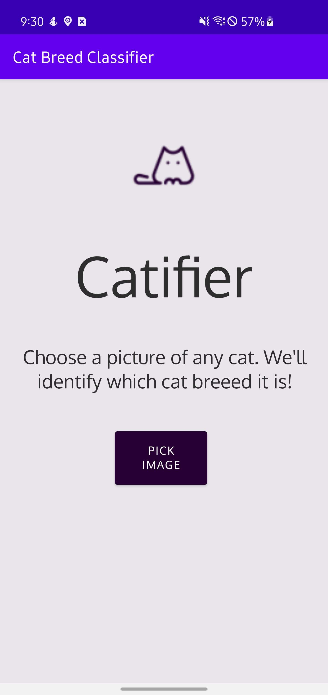
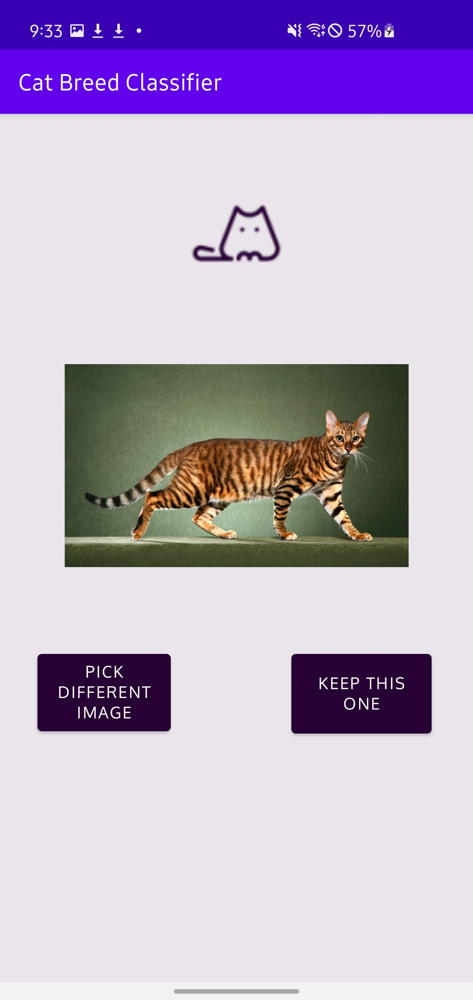
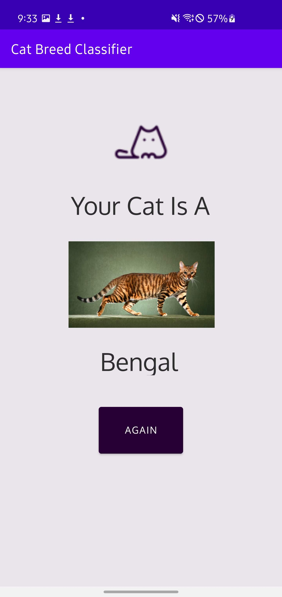
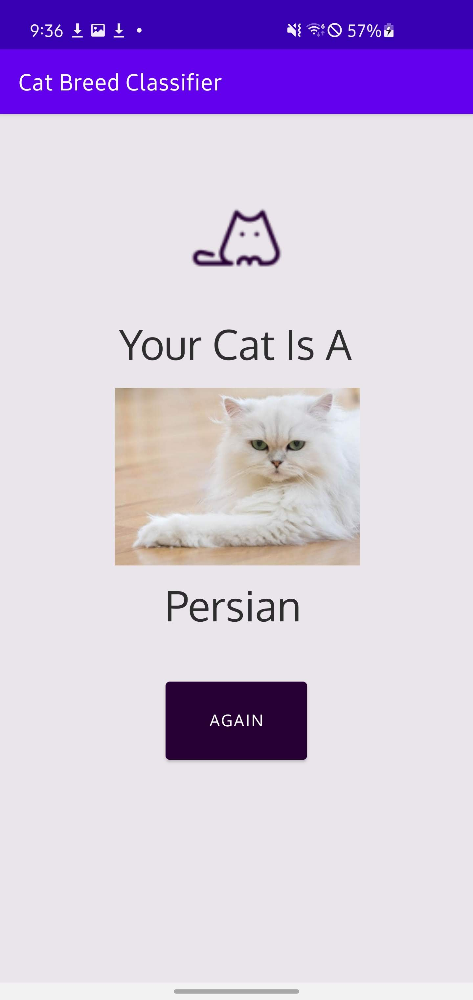
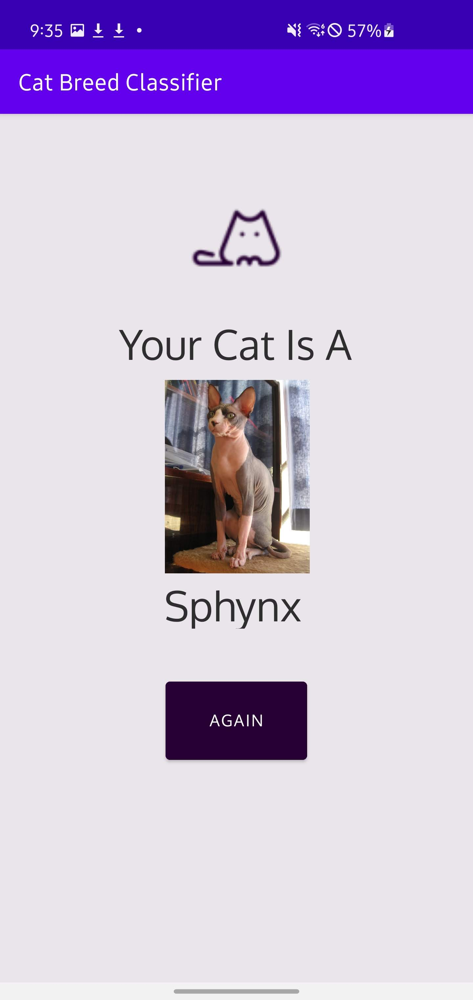
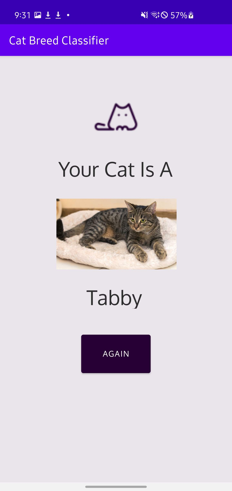

# Preview

    
    
    

    
    
    

# Overview

This app is able to identify 45 different cat breed by receiving an image from the gallery or phone camera. It was created by students at University of California, Davis.